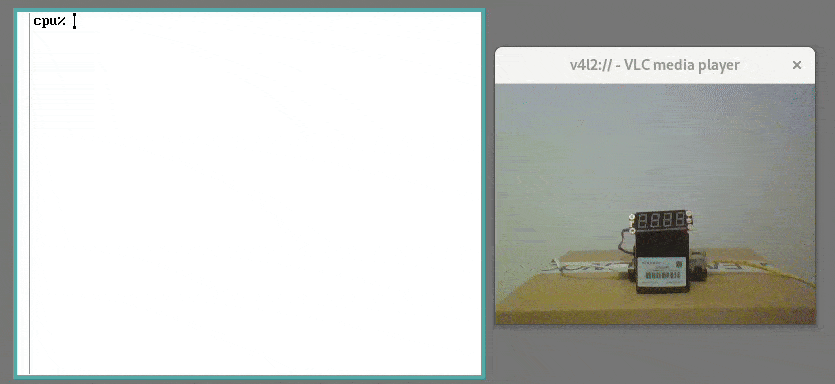

# tm1650fs

A Plan9 (9p) file system for tm1650 7-segment display display controller on I2C bus.

## about

tm1650fs provides control for a 7-segment display trough [tm1650](https://www.utmel.com/components/tm1650-led-drive-control-datasheet-pdf-circuit-and-pinout?id=849) controller, connected to a [I2C](https://en.wikipedia.org/wiki/I%C2%B2C) bus.

It provides a file in /srv.

`/srv/tm1650fs`

And automatically moutn in in the current namespace in /mnt, providing ctl and display file for control of the display.

`/mnt/tm1650/ctl`

`/mnt/tm1650/display`

The display module used for developing and testing was DFROBOT [DFR0645-R](https://wiki.dfrobot.com/4-Digital%20LED%20Segment%20Display%20Module%20%20SKU:%20DFR0645-G_DFR0645-R) connected to i2c1 on Raspberry Pi 1 running 9front with I2C enabled.

## requirements

A computer with I2C IO (eg. Raspberry Pi) running Plan9 or 9front with I2C support enabled/added.

## building

`mk`

## usage

Running tm1650fs will start the program and provide a file in /srv. In the namespace it was run, it will also mount ctl and display interface files in /mnt.

Once it has been run, it can be accessed from other namespaces by mounting the srv file

`mount -b /srv/tm1650fs /mnt`

The program provides two files for controlling the display:

### tm1650/ctl

Control file.

Cating the file will print out the current state of the display (on/off) and brightness.

`cat /mnt/tm1650/ctl`

Echoing commands (on, off, cls, brightness 0-7) will change the setting of the display.

`echo brightness 3 > /mnt/tm1650/ctl`

### tm1650/display

Display data file.

Cating the file will print out the current characters on the display.

`cat /mnt/tm1650/display`

Echoing characters (4 characters max, not counting the dots for each character) will change the display.

`echo Hi! > /mnt/tm1650/display`

## notes

It supports upper and lower case ASCII letters, numbers and some symbols.

Echoing wrong commands, unsupported characters or too many characters will result in the display displaying "Err!".

Yes, it can always be better.
